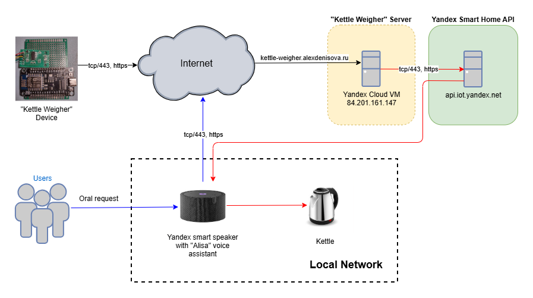
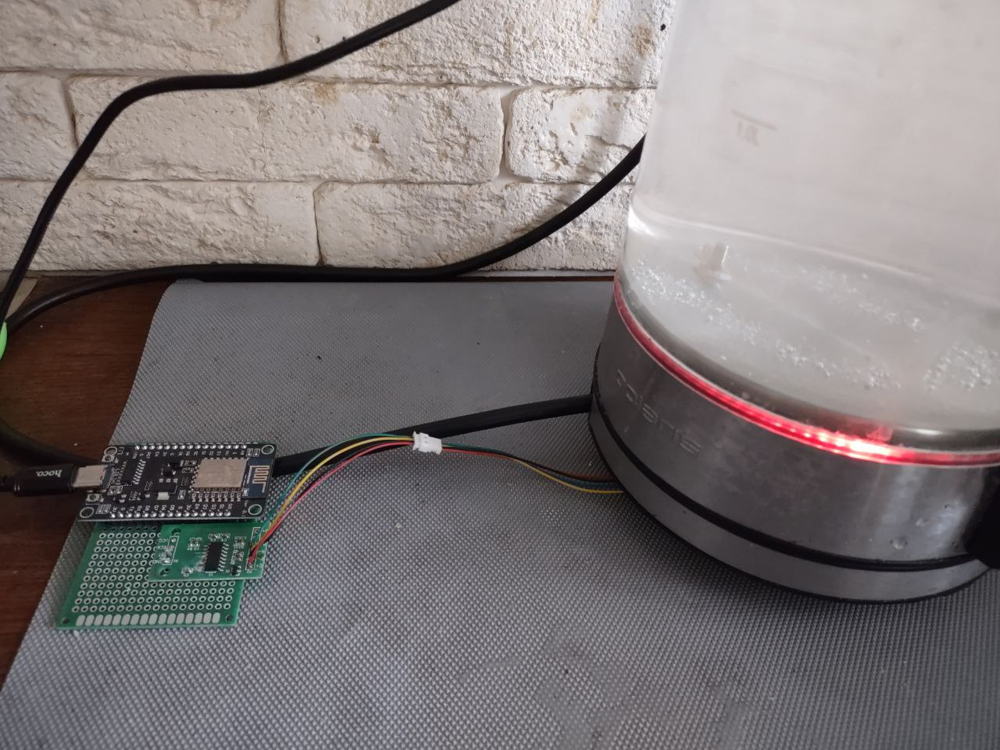
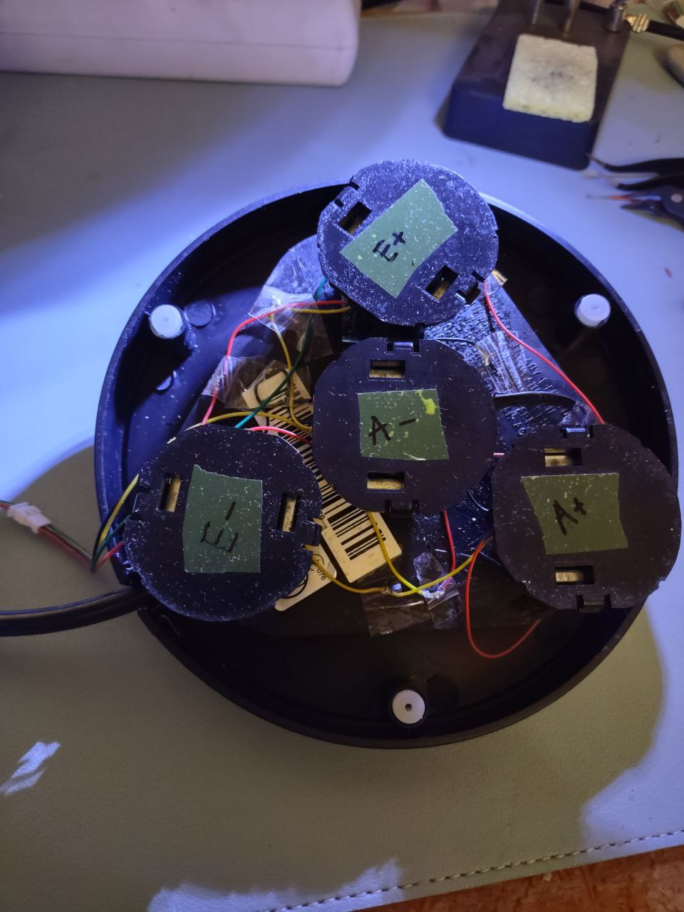
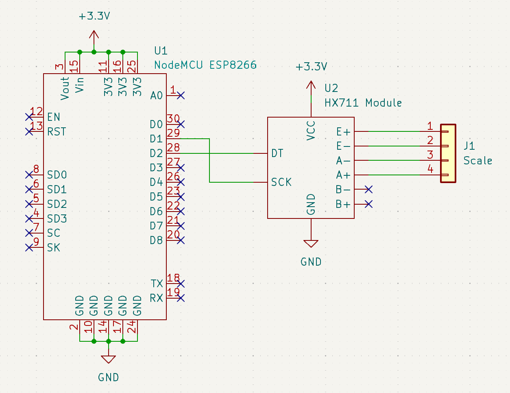

# kettle-weigher

The purpose of this project is to prevent my disappointment of finding the kettle empty when I want to make tea.

## How it works

The "Kettle Weigher" device measures the current weight of the kettle, calculates the amount of water in the kettle based on the total weight, and, if the amount of water has changed, sends the new value to a server deployed in Yandex Cloud at [kettle-weigher.alexdenisova.ru](https://kettle-weigher.alexdenisova.ru).

The server stores the last received value of the amount of water, as well as the minimum required amount needed to turn on the kettle. Through the server API, you can interact with the kettle — receive information about its current state and turn it on or off. To interact with the server API, authorization with the Yandex Oauth token is required.

The smart speaker with "Alisa" voice assistant is located in the same local network as the kettle. After receiving a request from the "Kettle Weigher" server (via api.iot.yandex.ru), "Alisa" will turn the kettle on.

In summary, when asking "Alisa" to turn on the kettle, she will send a request to the "Kettle Weigher" server. If there is enough water in the kettle, the server will send a request to "Alisa" (via api.iot.yandex.ru) to turn on the kettle. If there is not enough water, the server will respond to "Alisa" with a "Not enough water" status and the kettle will NOT be turned on.

## Video

In Russian, I ask "Alisa" to turn on the kettle. She tells me that there is not enough water and that I should add some and try again. After I add more water and ask again, she turns the kettle on.

https://github.com/user-attachments/assets/25276d6d-9977-403e-928d-f42c129b596c

## Photos

    
    
    

